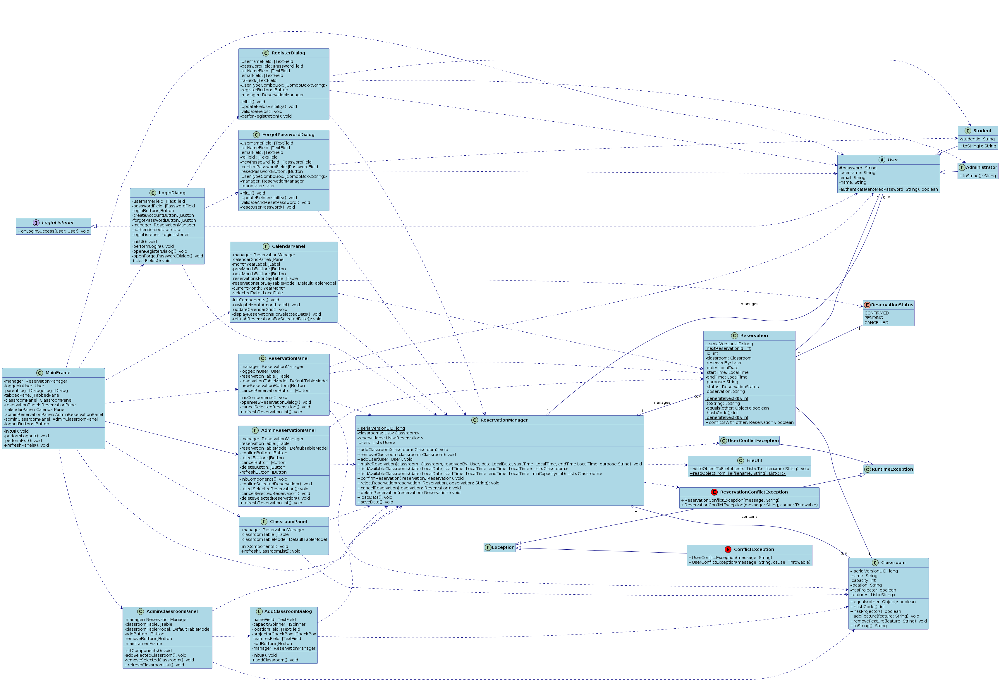

# Sistema de Gerenciamento de Reservas de Salas de Aula

Este projeto implementa um sistema de gerenciamento de reservas de salas de aula utilizando conceitos de Programação Orientada a Objetos (POO) em Java, com uma interface gráfica (GUI) desenvolvida em Swing. O sistema permite cadastrar salas, usuários (administradores e alunos) e realizar/cancelar reservas, com persistência de dados em arquivos.

## 1. Objetivo

Estudar e implementar os conceitos de programação orientada a objetos abordados na disciplina, por meio do desenvolvimento de um sistema definido pelo grupo. Este trabalho contempla a proposta, modelagem e implementação de um sistema orientado a objetos. O sistema foi descrito e desenvolvido em sua versão completa, estando pronto para manipulação por parte do usuário.

## 2. Requisitos do Sistema

Para compilar e executar este projeto, você precisará dos seguintes softwares:

* **Java Development Kit (JDK):** Versão 11 ou superior (preferencialmente a versão LTS mais recente, como JDK 17).
* **Ambiente Gráfico:** O sistema possui uma interface gráfica (GUI)10, portanto, ele deve ser executado em um ambiente que suporte a exibição de janelas (como Windows, macOS, ou um ambiente de desktop Linux).
    * Se estiver utilizando **WSL (Windows Subsystem for Linux)**, um servidor X no Windows é necessário.

## 3. Tópicos de POO Abordados

O projeto incorpora os seguintes conceitos de programação orientada a objetos:

* **Classes, variáveis e métodos:** O sistema contempla classes, seus atributos e métodos, incluindo sobrecarga.
* **Visibilidade:** Aplicação correta de modificadores de visibilidade (public, private, protected).
* **Herança:** Ao menos uma estrutura de herança foi implementada (ex: `User` com `Student` e `Administrator`).
* **Variáveis e métodos estáticos:** Inclui pelo menos uma variável e um método de classe (ex: `nextReservationId` em `Reservation`).
* **Arrays:** Utilizado quando necessário (ex: `ArrayList` para armazenar coleções de objetos).
* **Enumerações:** Incluído ao menos um exemplo de uso (ex: `ReservationStatus`).
* **Entrada e saída de dados:** Permite entrada e/ou saída de dados via GUI e arquivos.
* **Relacionamentos (associação, agregação ou composição):** Contempla ao menos um tipo de relacionamento (ex: `ReservationManager` agrega `Classroom` e `Reservation`).
* **Classes abstratas:** Implementada ao menos uma (ex: `User`).
* **Polimorfismo:** Inclui exemplos de polimorfismo de tipo e de método (ex: `User` e seus subtipos, sobrecarga de `findAvailableClassrooms`).
* **Interface gráfica:** O sistema é controlado por interface gráfica (GUI).
* **Tratamento de exceções:** Trata exceções, incluindo pelo menos uma exceção definida pelo grupo (`ReservationConflictException`).
* **Arquivos (leitura e gravação):** O sistema realiza operações de leitura e escrita em arquivos relevantes ao projeto (`data/classrooms.txt`, `data/reservations.txt`, `data/users.txt`).


## 4. Como Configurar e Rodar o Projeto

Siga os passos abaixo para preparar seu ambiente e executar a aplicação.

### 4.1. Instalação do JDK

Certifique-se de ter o JDK instalado. Você pode baixá-lo do site da Oracle ou usar uma distribuição OpenJDK (como Adoptium Temurin, Amazon Corretto, etc.).

Para verificar a instalação, abra um terminal (Prompt de Comando no Windows, Terminal no Linux/macOS, ou Terminal WSL) e digite:

```bash
java -version
javac -version
```

### 4.2. Configuração para Usuários WSL (Windows Subsystem for Linux)

Se você estiver rodando o projeto dentro do WSL e quiser que a interface gráfica apareça no Windows, siga estes passos adicionais:

1.  **Instale um Servidor X no Windows:**
    * Recomenda-se o **VcXsrv**.
    * **Download:** Baixe o VcXsrv (procure por "VcXsrv Windows X Server" no SourceForge).
    * **Instalação:** Execute o instalador e siga as instruções.
    * **Configuração e Inicialização:**
        * Após a instalação, procure por "XLaunch" no menu Iniciar do Windows e execute-o.
        * Na primeira tela ("Display settings"), escolha "Multiple windows" (ou "One large window").
        * **CRÍTICO:** Marque a opção "**Disable access control**". Isso permite que o WSL se conecte ao servidor X sem problemas de permissão.
        * Prossiga com as configurações padrão nas próximas telas e clique em "Finish". Um ícone do VcXsrv aparecerá na bandeja do sistema do Windows, indicando que está em execução.

2.  **Configurar Firewall do Windows:**
    * Certifique-se de que o Firewall do Windows não está bloqueando o VcXsrv.
    * No Windows, pesquise por "Permitir um aplicativo através do Firewall do Windows".
    * Clique em "Alterar configurações" e procure por "VcXsrv".
    * Marque as caixas "Privado" e "Público" para VcXsrv. Se não estiver na lista, clique em "Permitir outro aplicativo...", navegue até o executável (`C:\Program Files\VcXsrv\vcxsrv.exe`) e adicione-o.
    * Alternativamente, você pode adicionar uma regra de entrada para a porta TCP `6000` (porta padrão do X11) diretamente no "Firewall do Windows Defender com Segurança Avançada".

3.  **Configurar Variável `DISPLAY` no WSL:**
    * Abra seu terminal WSL (ex: Ubuntu).
    * Adicione as seguintes linhas ao seu arquivo de configuração do shell (`~/.bashrc` para Bash, ou `~/.zshrc` para Zsh):
        ```bash
        echo "export DISPLAY=\$(grep nameserver /etc/resolv.conf | awk '{print \$2}'):0.0" >> ~/.bashrc
        echo "export LIBGL_ALWAYS_INDIRECT=1" >> ~/.bashrc # Pode ser necessário para alguns apps
        ```
    * Recarregue o arquivo de configuração para aplicar as mudanças imediatamente:
        ```bash
        source ~/.bashrc
        ```
    * **Confirme o IP:** Digite `echo $DISPLAY` para verificar se a variável foi definida corretamente com um IP do seu host Windows (ex: `10.255.255.254:0.0`).

4.  **Instalar Bibliotecas X11 no WSL (se necessário):**
    ```bash
    sudo apt update
    sudo apt install -y libxext6 libxrender1 libxtst6 libfontconfig1 libxi6
    ```

5.  **Reiniciar o WSL (Altamente Recomendado):**
    * No PowerShell (ou Prompt de Comando) do Windows, execute:
        ```powershell
        wsl --shutdown
        ```
    * Espere alguns segundos para que o WSL pare completamente e então reabra seu terminal WSL.

**Observação para Windows 11 / WSLg:** Se você estiver usando Windows 11 com WSLg (Windows Subsystem for Linux GUI), a configuração do servidor X e da variável `DISPLAY` é automática. Você não precisaria realizar os passos de 5.2.1 a 5.2.5; basta ter o WSLg instalado e rodar a aplicação Java diretamente no WSL.

### 4.3. Compilando e Executando o Projeto

1.  **Navegue até o Diretório do Projeto:**
    * Abra um terminal (Prompt de Comando, PowerShell, Terminal Linux/macOS ou Terminal WSL).
    * Navegue até a raiz do diretório do projeto (onde está o `src` e este `README.md`).
    * Exemplo no Windows (se o projeto estiver em `C:\Projetos\MC322`):
        ```bash
        cd C:\Projetos\MC322
        ```
    * Exemplo no WSL (se o projeto estiver em `C:\Projetos\MC322`):
        ```bash
        cd /mnt/c/Projetos/MC322
        ```

2. **Ative a permissão para o arquivo Shell**
    * Rode o comando 
        ```bash
        chmod +x run.sh 
        ```

3.  **Compile os Arquivos Java e Execute os arquivos Java:**
    * Por fim, basta rodar o programa
        ```bash
        ./run.sh
        ```

## 5. Primeiros Acessos e Credenciais Padrão

Ao iniciar o sistema pela primeira vez, ele pode carregar alguns dados de exemplo (salas e usuários) se os arquivos de dados na pasta `data/` estiverem vazios ou não existirem.

* **Usuários de Teste (se gerados automaticamente no `Main.java`):**
    * **Administrador:**
        * **Usuário:** `admin`
        * **Senha:** `admin123`
    * **Aluno:**
        * **Usuário:** `aluno1`
        * **Senha:** `aluno123`
        * **Usuário:** `aluno2`
        * **Senha:** `aluno123`

## 6. Funcionalidades da Aplicação

O sistema oferece as seguintes funcionalidades principais:

* **Login de Usuários:** Autenticação como aluno ou administrador.
* **Visualização de Salas:** Lista todas as salas cadastradas com seus detalhes.
* **Gerenciamento de Reservas (Alunos):**
    * Permite fazer novas reservas de salas.
    * Permite visualizar suas próprias reservas.
    * Permite cancelar reservas existentes.
* **Gerenciamento de Salas (Administradores):**
    * Funcionalidades adicionais para adicionar novas salas (acessível via uma aba específica na interface).
* **Persistência de Dados:** As informações de salas, usuários e reservas são salvas e carregadas automaticamente de arquivos (`.txt`) localizados na pasta `data/`, garantindo a persistência dos dados entre as sessões.

## Diagrama de Classes 

O sistema completo é representado pelo diagrama de classes, mostrando as relações entre as diferentes classes


## Hierarquia Resumida

```
.
 └── src/
      └── model/     # Classes de modelo (Classroom , Reservation, User, Student, Administrator)
      └── manager/   # Classe para gerenciar a lógica de negócios (ReservationManager)
      └── exception/ # Classes de exceção personalizadas (ReservationConflictException)
      └── gui/    # Classes da interface gráfica do usuário (Swing)
      └── util/  # Classes utilitárias (FileUtil)
      └── Main.Java # Ponto de entrada principal da aplicação
 └── data/   # Diretório para arquivos de persistência de dados (classrooms.txt, reservations.txt, users.txt)
 └── MEMBROS.txt    # Lista dos membros do grupo
 └── Video.txt    # Link para o vídeo de apresentação do projeto
 └── UML/     # Pasta com o diagrama de classes 
 └── README.md     # Este arquivo (descrição do projeto)
```

## Problemas Comuns e Soluções

* **`java.awt.AWTError: Can't connect to X11 window server...`:** Este erro indica que o ambiente gráfico não foi configurado corretamente ou o servidor X não está acessível.
    * **Solução:** Revise a Seção 5.2 "Configuração para Usuários WSL", garantindo que o VcXsrv (ou Xming) esteja rodando, que a opção "Disable access control" esteja marcada, que o Firewall do Windows permita a comunicação, e que a variável `DISPLAY` no seu WSL esteja apontando para o IP correto do host Windows (e que o WSL tenha sido reiniciado após as configurações).
* **`Error: Could not find or load main class Main`:**
    * **Solução:** Verifique se você está executando o comando `java -cp src Main` a partir do diretório raiz do projeto e se a compilação (`javac`) foi bem-sucedida sem erros.
